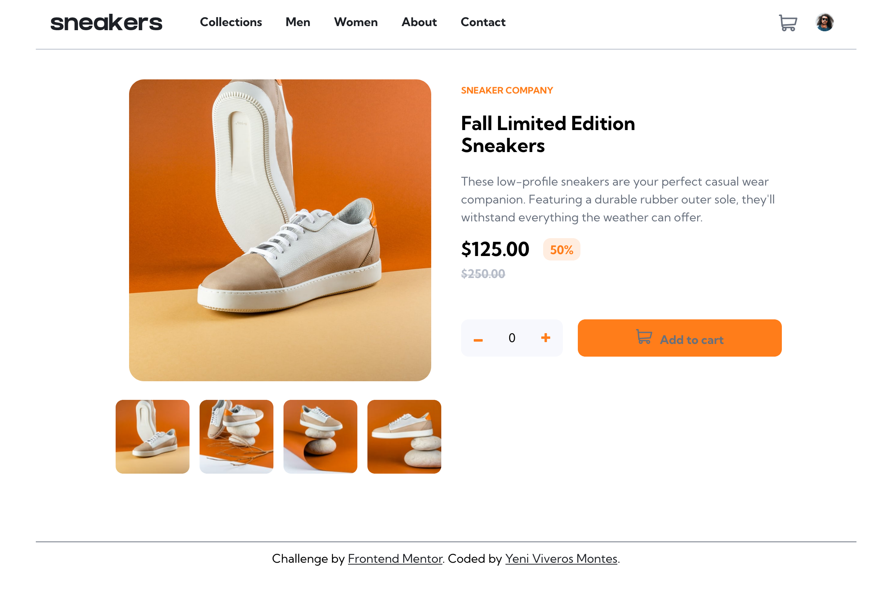

# Frontend Mentor - E-commerce product page solution

This is a solution to the [E-commerce product page challenge on Frontend Mentor](https://www.frontendmentor.io/challenges/ecommerce-product-page-UPsZ9MJp6). Frontend Mentor challenges help you improve your coding skills by building realistic projects.

## Table of contents

- [Overview](#overview)
  - [The challenge](#the-challenge)
  - [Screenshot](#screenshot)
  - [Links](#links)
- [My process](#my-process)
  - [Built with](#built-with)
  - [What I learned](#what-i-learned)
  - [Continued development](#continued-development)
  - [Useful resources](#useful-resources)
- [Author](#author)


## Overview

### The challenge

Users should be able to:

- View the optimal layout for the site depending on their device's screen size
- See hover states for all interactive elements on the page
- Open a lightbox gallery by clicking on the large product image
- Switch the large product image by clicking on the small thumbnail images
- Add items to the cart
- View the cart and remove items from it

### Screenshot




### Links

- Solution URL: [Add solution URL here](https://your-solution-url.com)
- Live Site URL: [Add live site URL here](https://your-live-site-url.com)

## My process

### Built with

- Semantic HTML5 markup
- CSS custom properties
- Flexbox
- CSS Grid
- JavaScript
- Mobile-first workflow


### What I learned

In this project I focused on experiment with JavaScript. Is the first time that I created an image gallery in two different ways by myself, as well as the functionality of an e-commerce page.

So, from my code, I'd highligh:
      
```js
function modificandoContenidoCarrito(){
    let costoTotal = (125 * numeroProductos);
    contenedorImagenCarritoCompras.style.display = 'block';
    parrafoCarritoCompras.innerHTML =  'Fall Limited Edition Sneakers';
    iconoBasurero.style.display = 'block';
    botonCheckout.style.display = 'block';
    costoProductosCarrito.innerHTML = 
    `
    $125.00 x ${numeroProductos} <span id="bold">$${costoTotal}.00</span>
    ` ;

    notificacionCarrito.style.display = 'block'
    notificacionCarrito.innerHTML = numeroProductos;
}

function aumentoProductos() {
    numeroProductos++;  
    cifraProductos.innerHTML = numeroProductos;    
}

function quitandoProductos(){
    if(numeroProductos > 0){
        numeroProductos--;
    }
    cifraProductos.innerHTML = numeroProductos;
}

function llamandoImagenes(){
    if(click == 1){  
        imagenBigUno.style.opacity = 1;
        imagenBigDos.style.opacity = 0;
        imagenBigTres.style.opacity = 0;
        imagenBigCuatro.style.opacity = 0;
    }else if(click == 2){
        imagenBigDos.style.opacity = 1;
        imagenBigTres.style.opacity = 0;
        imagenBigCuatro.style.opacity = 0;
        imagenBigUno.style.opacity = 0;
    }else if(click == 3){
        imagenBigTres.style.opacity = 1;
        imagenBigCuatro.style.opacity = 0;
        imagenBigUno.style.opacity = 0;
        imagenBigDos.style.opacity = 0;
    }else if(click == 4){
        imagenBigCuatro.style.opacity = 1;
        imagenBigUno.style.opacity = 0;
        imagenBigDos.style.opacity = 0;
        imagenBigTres.style.opacity = 0;
    }
}

function next(){  
    if(click < 4){
        click++;
    }
    llamandoImagenes(); 
}

function comeBack(){
    if(click > 1){
        click--;
    }
    llamandoImagenes();
}
```

### Continued development

On next projects I'll continue practicing my JavaScript skills and start to practice with React


### Useful resources

- [MDN Web Docs](https://developer.mozilla.org/es/) - I often check this website for anything.

## Author

- Website - [Yeni Viveros Montes](https://curriculum-yvm.netlify.app)
- LinkedIn - [Yeni Viveros Montes](https://www.linkedin.com/in/yeni-viveros-montes)


